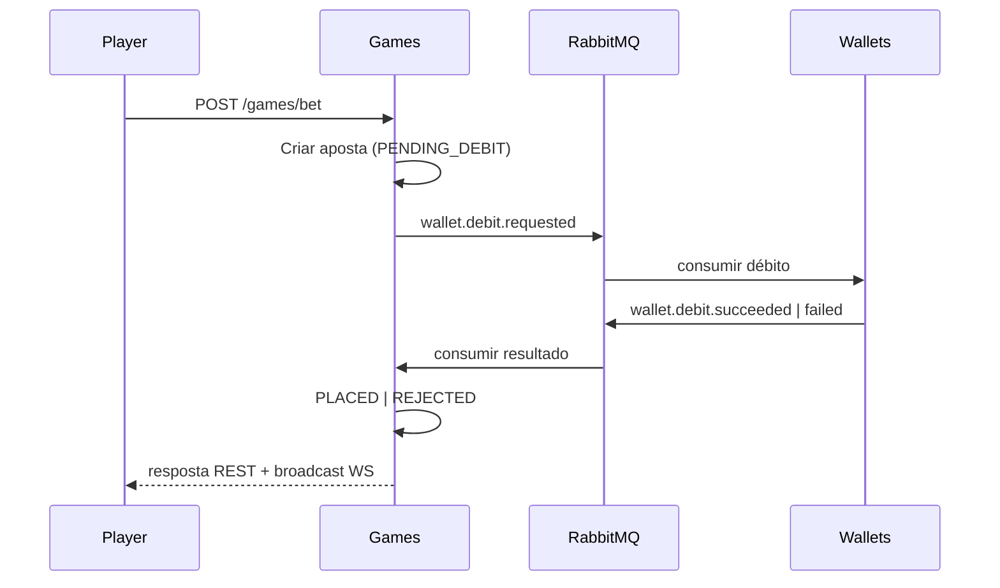
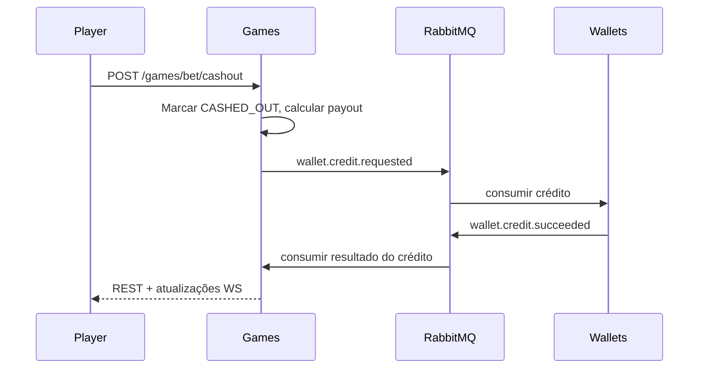

# Crash Game — Arquitetura de Implementação

Este documento descreve a implementação full-stack entregue do Crash Game: configuração, testes, contextos delimitados, mensageria, persistência, design provably fair, trade-offs e limitações conhecidas.

## Configuração rápida

**Pré-requisitos:** Bun >= 1.x, Docker e Docker Compose.

```bash
git clone <repository-url>
cd fullstack-challenge
bun install          # cria automaticamente arquivos .env a partir de .env.example via postinstall
bun run docker:up    # compila e inicia a stack completa
bun run docker:validate   # verificação de saúde opcional (poll)
```

Abra o jogo em **http://localhost:3000**.

| Serviço | URL |
| ------- | --- |
| Frontend | http://localhost:3000 |
| Kong API gateway | http://localhost:8000 |
| Games (direto) | http://localhost:4001 |
| Wallets (direto) | http://localhost:4002 |
| Keycloak | http://localhost:8080 |
| RabbitMQ UI | http://localhost:15672 |
| Games Swagger | http://localhost:4001/docs |

Não é necessário copiar `.env` manualmente. O `scripts/ensure-env.ts` é executado em `bun install` e `bun run docker:up`, criando arquivos de ambiente ausentes a partir dos templates.

### Usuário de teste

| Campo | Valor |
| ----- | ----- |
| Usuário | `player` |
| Senha | `player123` |
| Realm | `crash-game` |
| Client ID | `crash-game-client` (público, PKCE) |

O serviço de wallets define um saldo inicial (`WALLET_INITIAL_BALANCE_CENTS=100000` → **$1.000,00**) para o jogador de teste na primeira inicialização do container.

## Comandos de teste

```bash
# Helpers na raiz
bun run test:scripts
bun run test:frontend
bun run test:games:unit
bun run test:wallets:unit

# E2E (requer `bun run docker:up` e stack saudável)
bun run test:games:e2e
bun run test:wallets:e2e
bun run docker:validate

# Por workspace
cd services/games && bun test tests/unit
cd services/wallets && bun test tests/unit
cd services/games && bun test tests/e2e
cd services/wallets && bun test tests/e2e
cd frontend && bun run test    # Vitest + jsdom (use `bun run test`, não `bun test`)
```

Os testes de componentes do frontend exigem **Vitest** (`bun run test`). O runner nativo do Bun não oferece o mesmo ambiente `vi.mock` / jsdom.

## Arquitetura de alto nível

```txt
┌─────────────┐     REST (bet/cashout)      ┌──────────┐
│   Frontend  │ ───────────────────────────►│   Kong   │
│ Vite+React  │                             │  :8000   │
└──────┬──────┘                             └────┬─────┘
       │ WebSocket (servidor → cliente)          │
       │                                          ├──► Games  :4001
       └──────────────────────────────────────────├──► Wallets :4002
                                                    │
                    ┌──────────────┐    async     │
                    │  PostgreSQL  │◄─────────────┤
                    │ games/wallets│              │
                    └──────────────┘              │
                    ┌──────────────┐    RabbitMQ  │
                    │   RabbitMQ   │◄─────────────┘
                    └──────────────┘
                    ┌──────────────┐
                    │  Keycloak    │  validação JWT (OIDC)
                    └──────────────┘
```

**Princípios de design:**

- **Contextos delimitados:** Games é dono de rounds/apostas/crash/provably fair/WebSocket; Wallets é dono de saldos e ledger.
- **Integração assíncrona:** Débito/crédito entre serviços usa comandos/eventos RabbitMQ com chaves de idempotência — sem mutações HTTP diretas na wallet a partir do Games.
- **Dinheiro:** Todos os saldos e pagamentos usam **centavos em bigint** de ponta a ponta; multiplicadores usam basis points / strings decimais, nunca float para dinheiro.
- **WebSocket:** Apenas servidor → cliente; ações do jogador usam REST via Kong.

## Contextos delimitados

### Games (`services/games`)

| Agregado | Responsabilidade |
| -------- | ---------------- |
| **Round** | Ciclo de vida: BETTING → RUNNING → CRASHED → SETTLED |
| **Bet** | Uma aposta por jogador por round; PENDING_DEBIT → PLACED → CASHED_OUT / LOST |

Camadas: `domain` → `application` → `infrastructure` → `presentation`.

- Domain: entidades, value objects, serviço provably fair, invariantes.
- Application: casos de uso (apostar, cash out, motor de rounds, handlers de resultado da wallet).
- Infrastructure: repositórios Prisma, publishers/consumers RabbitMQ.
- Presentation: controllers REST, gateway WebSocket, guard JWT.

### Wallets (`services/wallets`)

| Agregado | Responsabilidade |
| -------- | ---------------- |
| **Wallet** | Saldo por jogador; nunca negativo |
| **WalletTransaction** | Entrada imutável no ledger por crédito/débito |

Débito/crédito são acionados apenas por mensagens do broker (`wallet.debit.requested`, `wallet.credit.requested`). REST expõe criação de wallet e leitura de saldo.

## Fluxo de eventos RabbitMQ

Todas as mensagens usam um envelope versionado com `idempotencyKey`, `correlationId` e `payload` tipado.

### Fazer aposta



### Cash out



Os consumidores são **idempotentes**: mensagens duplicadas com a mesma `idempotencyKey` não alteram o estado duas vezes.

## Persistência com Prisma

Bancos de dados e schemas separados por serviço (PostgreSQL 18):

| Serviço | Banco de dados | Caminho do schema |
| ------- | -------------- | ----------------- |
| Games | `games` | `services/games/prisma/schema.prisma` |
| Wallets | `wallets` | `services/wallets/prisma/schema.prisma` |

- As migrations rodam automaticamente na inicialização do container (`prisma migrate deploy` em `docker-entrypoint.sh`).
- Colunas de dinheiro usam centavos em `BigInt`.
- Multiplicadores armazenados como basis points ou `Decimal` quando necessário — não float para dinheiro.
- A camada de domínio nunca importa `@prisma/client`; mappers traduzem entre modelos Prisma e entidades de domínio.

## Provably fair

Algoritmo: **HMAC_SHA256_SHA256_HASH_COMMITMENT**

1. Antes de abrir as apostas, o Games gera um `serverSeed` e publica apenas `serverSeedHash = SHA256(serverSeed)`.
2. O crash point é derivado deterministicamente de `serverSeed`, `clientSeed` e `nonce` usando HMAC-SHA256 e uma fórmula de espaço de 52 bits com 1% de house edge.
3. Após crash/liquidação, o `serverSeed` é revelado.
4. `GET /games/rounds/:roundId/verify` retorna todos os campos de verificação para checagem independente.

Os jogadores podem confirmar `SHA256(serverSeed) === serverSeedHash` e recalcular o crash point a partir das constantes do algoritmo publicadas.

## Frontend

- **Vite + React 19**, TanStack Query (estado do servidor), Zustand (round/multiplicador/toasts em tempo real).
- Login **OIDC** via Keycloak com authorization code + PKCE.
- O **multiplicador visual** interpola localmente entre ticks do WebSocket, mas nunca autoriza cash out — o backend é a fonte da verdade.
- **Requisitos de UI entregues explicitamente:**
  - Timer de contagem regressiva para apostas (`bettingEndsAt`)
  - Payout potencial no botão Cash Out (estimativa a partir do multiplicador ao vivo × centavos da aposta)
  - Skeletons/spinners de carregamento (saldo da wallet, gráfico do round)
  - Destaque em nível de linha para apostas com cash out

## Trade-offs

| Decisão | Justificativa |
| ------- | ------------- |
| RabbitMQ em vez de HTTP síncrono | Desacopla contextos; sobrevive à latência da wallet; alinha com colocação de aposta estilo saga |
| Kong DB-less com config declarativa | Dev local simples; rotas versionadas no repositório |
| Interpolação do multiplicador visual | UX mais fluida; ticks autoritativos recalibram o drift |
| Uma aposta por round | Atende às regras do desafio; simplifica invariantes do agregado |
| Prisma por serviço | Entrega rápida com migrations; sem acoplamento de schema compartilhado |
| CSS via `styles.css` simples | MVP mais rápido que Tailwind/shadcn para o escopo da avaliação |

## Limitações conhecidas

- Sem outbox/inbox transacional — entrega at-least-once depende apenas de consumidores idempotentes.
- Sem auto cash-out, auto bet ou rate limiting.
- O payout no Cash Out no frontend é uma **estimativa** para exibição; a liquidação usa o multiplicador do servidor no momento da requisição.
- Testes E2E acessam a stack Docker real (instáveis se os serviços demorarem a subir); use `docker:validate` antes.
- URLs de issuer `localhost` do Keycloak exigem que browser e serviços concordem nos hostnames (configurado para dev local).
- Histórico de rounds no frontend limita a exibição; a API suporta paginação.

## O que melhoraria com mais tempo

1. **Outbox transacional** em Games e Wallets para publicação garantida após commit.
2. **Pipeline de CI** (GitHub Actions): testes unitários em todo push, E2E em schedule ou label de PR.
3. **Playwright** E2E no browser para fluxos completos login → aposta → cashout.
4. **Observabilidade**: logs estruturados, traces OpenTelemetry entre REST e RabbitMQ.
5. **Plugin JWT do Kong** na camada de gateway (hoje a validação JWT está nos guards NestJS).
6. **Override de compose dedicado para dev local** com mounts de hot-reload nos serviços.
7. **Polish com Tailwind + shadcn/ui** quando os critérios funcionais estiverem estáveis.
